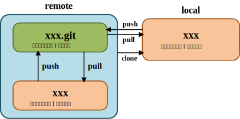
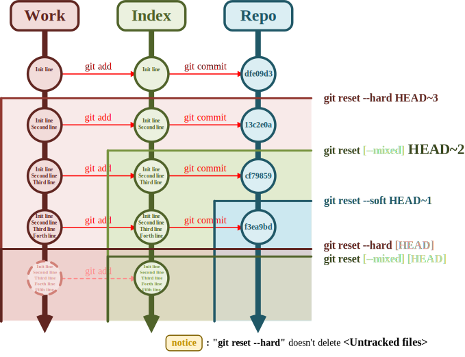
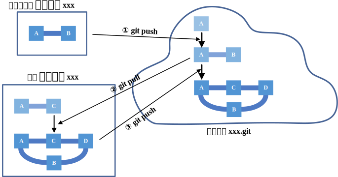
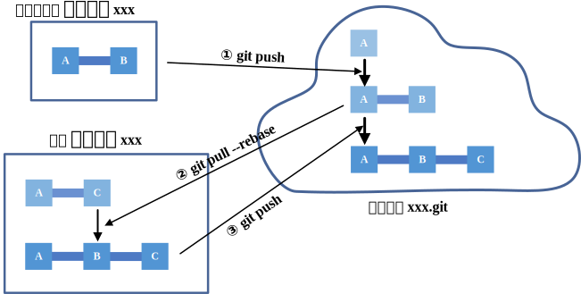

# DWH Work Mode

## DWH Work Mode 介绍

> [!note]
>
> 双端热修复工作模式（Dual-Workspace Hotfix Work Mode, **DWH**）是指 **以一个裸仓库为中心，同时维护两个工作副本（本地+服务器），在本地仓库进行主要开发工作、在服务器仓库进行小规模即时修复，所有改动通过 push/pull 同步** 的一种基于 git 的工作模式。

> [!tip]
>
> **DWH** 本质上是 `1+2` 的协作模式，根据 DWH，可以推广至 `1+n` 的协作模式，即多端热修复工作模式（Multi-Workspace Hotfix Work Mode, **MWH**）：**以一个裸仓库为中心，同时维护多个工作副本（多设备+服务器），在其他设备仓库进行主要开发工作、在服务器仓库进行小规模即时修复，所有改动通过 push/pull 同步** 的一种基于 git 的工作模式。

### 仓库作用说明:star:

- **远程服务器：**
  - `xxx.git`：**裸仓库**  【中央仓库 | 接收所有 push，提供 clone/pull 来源；无工作区】
  - `xxx`：**普通仓库**  【运行调试环境 | 负责运行代码、临时调试、小规模修复】

- **本地：**
  - `xxx`：**普通仓库**  【主要开发环境 | 大规模修改】

如下图所示：



### 工作模式说明

- 在[**本地普通仓库**](#本地开发)进行主要的开发工作，开发完成后，`git push` 到**中央仓库**；
- 在[**远程普通仓库**](远程服务器运行、测试)进行运行、调试代码的工作：
  - 在运行过程中进行必要的小幅修改（如语法错误、数值变动等），并及时 `git push`；
  - 在运行过程中进行临时调试（一般不需要保留）。

### DWH 工作模式中的原则:warning:

> [!warning]
>
> 任何工作目录 / 普通仓库：
>
> - 修改前：先 `pull`；
> - 修改后：要么 `commit + push`、要么丢弃/还原。

>  [!warning]
>  
>  所有最终代码必须 `push` 到中央仓库 `xxx.git` 中；

- `.gitignore` 文件

`.gitignore` 文件中建议记录**本地内容和服务器内容天然不同、变化频繁**的文件，如：

```txt
- 配置文件 (*.conf, *.yaml)
- 日志文件 (log/, *.log)
- 临时缓存 (temp/, cache/)
- 数据文件 (data/, *.mat)
- 权重文件
- 输出结果文件 (output/, output_*.txt)
- IDE 配置文件 (.vscode/)
- 环境相关文件
```

## Git Command

### 构建 DWH 工作模式:star:

- **远程服务器**

  - 创建中央仓库 `xxx.git`

    ```sh
    mkdir xxx.git # 必须是空文件夹
    cd xxx.git
    git init --bare # 初始化当前目录为空 git 裸仓库
    ```

  - 创建普通仓库 `xxx`

    ```sh
    mkdir xxx # 可以是已有文件的文件夹
    cd xxx
    git init # 初始化当前目录为空 git 仓库
    
    # 若没有设置全局 config，需要设置一下 config（推荐设置局部 config）
    git config user.name "name"
    git config user.email "xxx@email.com"
    # 若需要设置全局 config，添加 --global 参数即可
    git config --global user.name "name"
    git config --global user.email "xxx@email.com"
    
    # 提交修改的内容
    git add .
    git commit -m "init info ..."
    
    # 连接远程中央仓库
    git remote add origin /path/to/xxx.git
    git push -u origin master # 推送 commit 到中央仓库
    ```

- **本地**

  `clone` 远程服务器仓库到本地

  ```sh
  git clone user@ip:/path/to/xxx.git # clone 远程服务器上的仓库到本地（当前目录下）
  ```

### 若干常见情况下的操作

#### 本地开发

```sh
git pull # 先拉取、同步远程的 commit
# new, modify, delete ...
git add .
git commit -m "commit info ..."
git push # 推送 commit 到远程
```

#### 远程服务器运行、测试

```sh
git pull # 先拉取、同步远程的 commit
```

- 对代码的小规模修复，**需要提交、保留**

  ```sh
  git add .
  git commit -m "commit info"
  git push # 推送 commit 到远程
  ```

- 对代码进行调试、临时测试（如打印一些中间变量等）后，**无需提交、保留**

  ```sh
  # 单文件修改后，进行还原
  git restore <file>
  
  # 多文件修改后，进行还原
  git reset --hard
  ```
  
  > **git reset** 详细使用见 [附录 · git reset](#git reset)

#### 双端同时工作

在双端同时进行修改、提交操作时，一端先 push 它的 commit 后，建议另一端执行：

```sh
git pull --rebase
```

进行对远端内容的拉取、同步。

> **git pull --rebase** 详细说明见 [附录 · git pull --rebase](#git pull --rebase)

#### 查看仓库状态

```sh
git status # 当前仓库文件的提交情况

git log # 版本提交日志
git log --oneline --graph --decorate -n 10 # 版本提交日志，美化输出

git remote -v # 当前仓库关联的远程 git 仓库信息
git branch -vv # 当前所在仓库分支的远程跟踪信息
```


---

## 附录

### 常用 Git Command 一览表

|   动作   |                    详细命令                    |            说明             |
| :------: | :--------------------------------------------: | :-------------------------: |
|  初始化  |                    git init                    |  初始化当前目录为 git 仓库  |
|          |                git init --bare                 | 初始化当前目录为 git 裸仓库 |
| 版本控制 |                git add <file/.>                |      添加文件到暂存区       |
|          |              git commit -m "log"               |      提交暂存区的文件       |
|          |                    git push                    |        推送到 remote        |
|          |                    git pull                    |        同步远程仓库         |
|          |    [git pull --rebase](#git pull --rebase)     |    同步远程仓库（变基）     |
|          |     git remote add origin /path/to/xxx.git     |         添加 remote         |
|          |       git clone user@ip:/path/to/xxx.git       |        克隆指定仓库         |
|   回退   |              git restore \<file\>              |          还原文件           |
|          |             git restore --stage .              | 还原暂存区（回退暂存操作）  |
|          |            [git reset](#git reset)             |     回退暂存操作（add）     |
|          |            git reset --soft HEAD~1             |   回退提交操作（commit）    |
|          |                git reset --hard                |       回退暂存和提交        |
|   查看   |                   git status                   |        查看仓库状态         |
|          |                    git log                     |        查看提交日志         |
|          |               git log --oneline                |    查看提交日志（简洁）     |
|   标签   |                    git tag                     |        列出所有标签         |
|          |                git show \<tag\>                |     查看指定标签的细节      |
|          |                git tag \<tag\>                 |    给当前提交打轻量标签     |
|          | git tag -a \<tag\> -m \<message\> \<commitID\> | 给指定提交打标签并备注信息  |
|          |      git push origin \<tag_1\> \<tag_n\>       |     推送一个或多个标签      |
|          |             git push origin --tags             |        推送全部标签         |
|          |               git tag -d \<tag\>               |      删除本地指定标签       |
|          |   git push origin -d tag \<tag_1\> \<tag_n\>   |      删除远程指定标签       |

### git reset

`git reset [<mode>] [<commit>]` 参数说明：

- \<mode\>

  |     mode      |                  作用                  |
  | :-----------: | :------------------------------------: |
  |   `--soft`    |            只回退**版本库**            |
  | **`--mixed`** |       回退**暂存区**和**版本库**       |
  |   `--hard`    | 回退**工作区**、**暂存区**和**版本库** |

- \<commit\>

  |    commit     |           说明           |
  | :-----------: | :----------------------: |
  |  **`HEAD`**   |   回退到最近的 commit    |
  |   `HEAD~n`    | 回退到 n 个之前的 commit |
  | `commit hash` |   回退到指定的 commit    |

git 仓库由三棵树组成：**工作区（Work）、暂存区（Index）、版本库（Repo）**，如下图所示：



执行图中右侧命令时，其对应折线下方区域中的节点将会被移除，剩下的节点构成的三棵树即是执行命令后的仓库状态。

### git pull --rebase

`rebase` 模式会将 **本地的提交** 挂在 **远端拉取过来的提交** 之后。

比如下面这个例子：

> 双端在同一个分支的同一个 commit (A) 同时进行了修改和 commit；
>
> 远程仓库进行了新的 commit (B) 后，先 push 到了中央仓库；
>
> 本地仓库进行了新的 commit (C) 后，与中央仓库冲突，必须先进行 pull 才能继续 push。

此时有两个选择：

- 执行 `git pull`，git 会将 B 和 C merge 为 D，如下图所示，可能使提交历史增加无用的 merge 信息；

  

- 执行 `git pull --rebase`，git 会将 C 挂在 B 之后，如下图所示，这样可以保持历史数据的线性干净。

  
